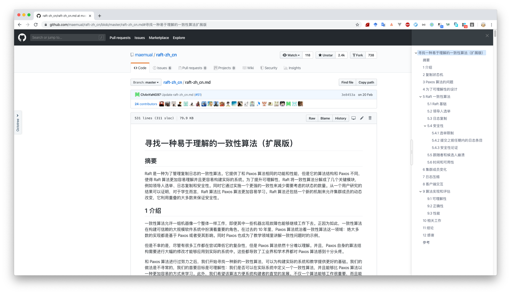

<h1 align="center">Welcome to github-markdown-toc-sidebar 👋</h1>

> a chrome extension for github to show &#34;table of content&#34; of *.md file

### 🏠 [Homepage](https://github.com/yangsoon/github-markdown-toc-sidebar)

## Install

**just for test**
**注意这只是测试demo，还不能完美运行在chrome中**

1. download zip file from releases
2. open Chrome, At the top right, click More More tools Extensions, drag zip in chrome

## DEMO

## TODO

* [x] 页面最左边中间添加打开目录的按钮
* [ ] 记录用户在某个页面的浏览记录
* [ ] 点击目录跳转的时候，滚动平滑
* [ ] 当页面切换的时候还不能主动更新目录
* [x] 目录左右切换
* [ ] 当浏览器窗口过小的时候，压缩github的页面
* [ ] webpack修改vue为运行时模块
* [ ] 添加图标

## Author

👤 **yangsoon**

* Github: [@yangsoon](https://github.com/yangsoon)

## 🤝 Contributing

Contributions, issues and feature requests are welcome! Feel free to check [issues page](https://github.com/yangsoon/github-markdown-toc-sidebar/issues).

## Show your support

Give a ⭐️ if this project helped you!

***
_This README was generated with ❤️ by [readme-md-generator](https://github.com/kefranabg/readme-md-generator)_